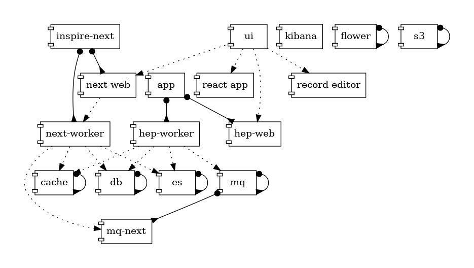

# Inspirehep

## Pre requirements

### Python

Python `3.11`

You can also use [pyenv](https://github.com/pyenv/pyenv) for your python installations.
Simply follow the [instructions](https://github.com/pyenv/pyenv#installation) and set the global version to 3.11.

#### Debian / Ubuntu

```bash
$ sudo apt-get install python3 build-essential python3-dev
```

#### MacOS

```bash
$ brew install postgresql@14 libmagic openssl@3 openblas python
```

### nodejs & npm using nvm

Please follow the instructions https://github.com/nvm-sh/nvm#installing-and-updating

We're using `v20.0.0` (first version we install is the default)

```
$ nvm install 20.0.0
$ nvm use global 20.0.0
```

### yarn

#### Debian / Ubuntu

Please follow the instructions https://classic.yarnpkg.com/en/docs/install/#debian-stable

#### MacOS

```bash
$ brew install yarn
```

### poetry

install `poetry` https://poetry.eustace.io/docs/

```bash
$ curl -sSL https://raw.githubusercontent.com/sdispater/poetry/master/get-poetry.py | python -
```

### pre-commit

install `pre-commit` https://pre-commit.com/

```bash
$ curl https://pre-commit.com/install-local.py | python -
```

And run

```bash
$ pre-commit install
```

### Docker & Docker Compose

#### The topology of docker-compose



Follow the guide https://docs.docker.com/compose/install/

### For MacOS users

#### General

Turn of the `AirPlay Receiver` under System Preference -> Sharing -> AirPlay Receiver.
Otherwise, you will run into problems with port 5000 being already in use.
See [this](https://developer.apple.com/forums/thread/682332) for more information.

#### M1 users

Install `Homebrew-file` https://homebrew-file.readthedocs.io/en/latest/installation.html

```bash
$ brew install rcmdnk/file/brew-file
```

And run

```bash
$ brew file install
```

---

## Run with docker

### Make

This will prepare the whole inspire development with demo records:
```bash
make run
```

This spinup the whole inspirehep development with demo records but without the backoffice
```bash
make run-inspirehep
```

This will spin up a backoffice
```bash
make run-backoffice
```

You can stop it by simply run

```bash
make stop
```

Alternatively you can follow the steps:

### Step 1: In a terminal run

```bash
docker-compose up
```

### Step 2: On another browser run

```bash
docker-compose exec hep-web ./scripts/setup
```

### Step 3: Import records

```bash
docker-compose exec hep-web inspirehep importer demo-records
```

### Usage

inspirehep should now be available under http://localhost:8080

---

## Run locally

### Backend

```bash
$ cd backend
$ poetry install
```

### UI

```bash
$ cd ui
$ yarn install
```

### Editor

```bash
$ cd record-editor
$ yarn install
```

---

### Setup

First you need to start all the services (postgreSQL, Redis, ElasticSearch, RabbitMQ)

```bash
$ docker-compose -f docker-compose.services.yml up es mq db cache
```

And initialize database, ES, rabbitMQ, redis and s3

```bash
$ cd backend
$ ./scripts/setup
```

Note that s3 configuration requires default region to be set to `us-east-1`. If you have another default setup in your AWS config (`~/.aws/config`) you need to update it!

Also, to enable fulltext indexing & highlighting the following feature flags must be set to true:

```
FEATURE_FLAG_ENABLE_FULLTEXT = True
FEATURE_FLAG_ENABLE_FILES = True
```

### Run

#### Backend

You can visit Backend http://localhost:8000

```bash
$ cd backend
$ ./scripts/server
```

#### UI

You can visit UI http://localhost:3000

```bash
$ cd ui
$ yarn start
```

#### Editor

```bash
$ cd ui
$ yarn start
```

In case you wanna use docker and just run the record-editor locally, use the following steps:
1. Add the following volume mount to the record-editor service in the [docker-compose.yml](docker-compose.yml):
    * `- ./record-editor/dist/:/usr/share/nginx/html`
2. Navigate into the record-editor folder and first run `yarn` and then `yarn start`
3. Open a second terminal and run `make run`

The record editor should now be availabe and automatically update when changes are made to the codebase.


#### General
You can also connect UI to another environment by changing the proxy in `ui/setupProxy.js`

```javascript
proxy({
  target: 'http://A_PROXY_SERVER',
  ...
});
```

---

## How to test

### Backend

The backend tests locally use [`testmon`](https://github.com/tarpas/pytest-testmon) to only run tests that depend on code that has changed (after the first run) by default:

```bash
$ cd backend
$ poetry run ./run-tests.sh
```

If you pass the `--all` flag to the `run-tests.sh` script, all tests will be run (this is equivalent to the `--testmon-noselect` flag). All other flags passed to the script are transferred to `py.test`, so you can do things like

```bash
$ poetry run ./run-tests.sh --pdb -k test_failing
```

You'll need to run all tests or force test selection (e.g. with `-k`) in a few cases:

- an external dependency has changed, and you want to make sure that it doesn't break the tests (as `testmon` doesn't track external deps)
- you manually change a test fixture in a non-python file (as `testmon` only tracks python imports, not external data)

If you want to invoke `py.test` directly but still want to use `testmon`, you'll need to use the `--testmon --no-cov` flags:

```bash
$ poetry run py.test tests/integration/records --testmon --no-cov
```

If you want to disable `testmon` test selection but still perform collection (to update test dependencies), use `--testmon-noselect --no-cov` instead.

Note that `testmon` is only used locally to speed up tests and not in the CI to be completely sure _all_ tests pass before merging a commit.

#### SNow integration tests

If you wish to modify the SNow integration tests, you have to set the following variables in the SNow [config](https://github.com/inspirehep/inspirehep/blob/master/backend/inspirehep/snow/config.py)
file:

```
 SNOW_CLIENT_ID
 SNOW_CLIENT_SECRET
 SNOW_AUTH_URL
```

The secrets can be found in the inspirehep QA or PROD sealed secrets.
After setting the variables, run the tests, so the cassettes get generated.

**Before you push dont forget to delete the secrets from the config file!**

### UI

```bash
$ cd ui
$ yarn test # runs everything (lint, bundlesize etc.) indentical to CI
$ yarn test:unit # will open jest on watch mode
```

Note that `jest` automatically run tests that changed files (unstaged) affect.

### cypress (e2e)

Runs everything from scratch, identical to CI

```bash
$ sh cypress-tests-chrome.sh
$ sh cypress-tests-firefox.sh
```

Opens cypress runner GUI runs them against local dev server (localhost:8080)

```bash
$ cd e2e
$ yarn test:dev
$ yarn test:dev --env inspirehep_url=<any url that serves inspirehep ui>
```

#### visual tests

Visual tests are run only on `headless` mode. So `yarn test:dev` which uses the headed browser will ignore them.
Running existing visual tests and updating/creating snapshots requires `cypress-tests.sh` script.

For continuous runs (when local DB is running and has required records etc.), the script can be reduced to only the last part `sh cypress-tests-run.sh`.

If required, tests can run against `localhost:3000` by simply modifying `--host` option in `sh cypress-tests-run.sh`.

#### working with (visual) tests more efficiently

You may not always need to run tests exactly like on the CI environment.

- To run specific suite, just change `test` script in `e2e/package.json` temporarily to `cypress run --spec cypress/integration/<spec.test.js>`

## How to import records

First make sure that you are running:

```bash
$ cd backend
$ ./scripts/server
```

There is a command `inspirehep importer records` which accepts url `-u`, a directory of `JSON` files `-d` and `JSON` files `-f`.
A selection of demo records can be found in `data` directory and they are structure based on the record type (i.e. `literature`). Examples:

#### With url

```bash
# Local
$ poetry run inspirehep importer records -u https://inspirehep.net/api/literature/20 -u https://inspirehep.net/api/literature/1726642
# Docker
$ docker-compose exec hep-web inspirehep importer records -u https://inspirehep.net/api/literature/20 -u https://inspirehep.net/api/literature/1726642

# `--save` will save the imported record also to the data folder
$ <...> inspirehep importer records -u https://inspirehep.net/api/literature/20 --save
```

Valid `--token` or `backend/inspirehep/config.py:AUTHENTICATION_TOKEN` is required.

#### With directory

```bash
# Local
$ poetry run inspirehep importer records -d data/records/literature
# Docker
$ docker-compose exec hep-web inspirehep importer records -d data/records/literature
```

#### With files

```bash
# Local
$ poetry run inspirehep importer records -f data/records/literature/374836.json -f data/records/authors/999108.json
# Docker
$ docker-compose exec hep-web inspirehep importer records -f data/records/literature/374836.json -f data/records/authors/999108.json
```

#### All records

```bash
# Local
$ poetry run inspirehep importer demo-records
# Docker
$ docker-compose exec hep-web inspirehep importer demo-records
```
